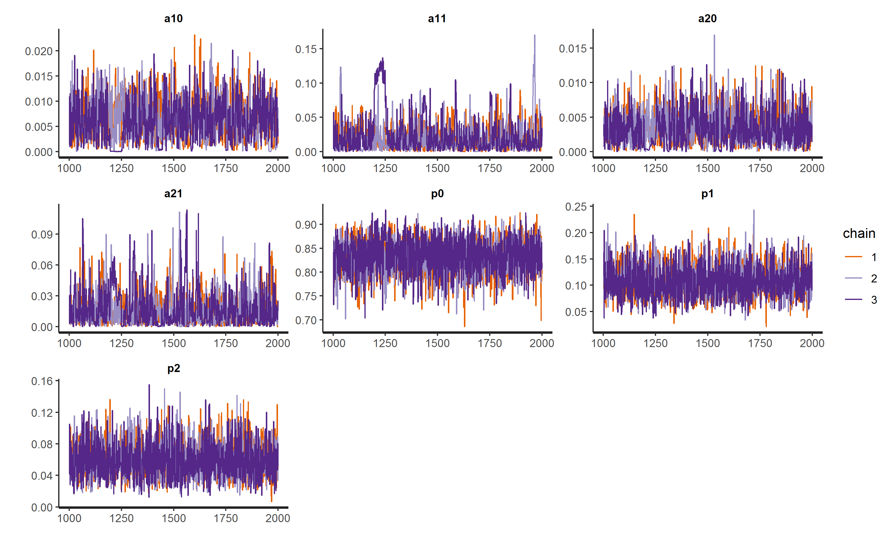
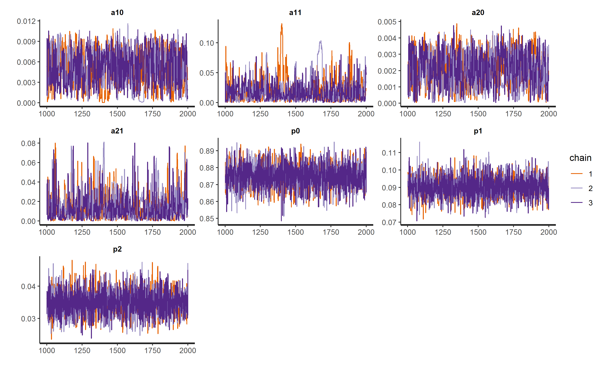
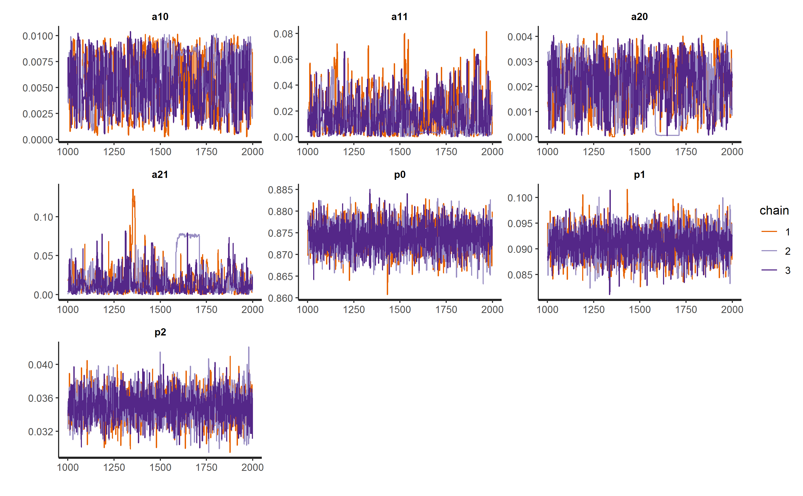
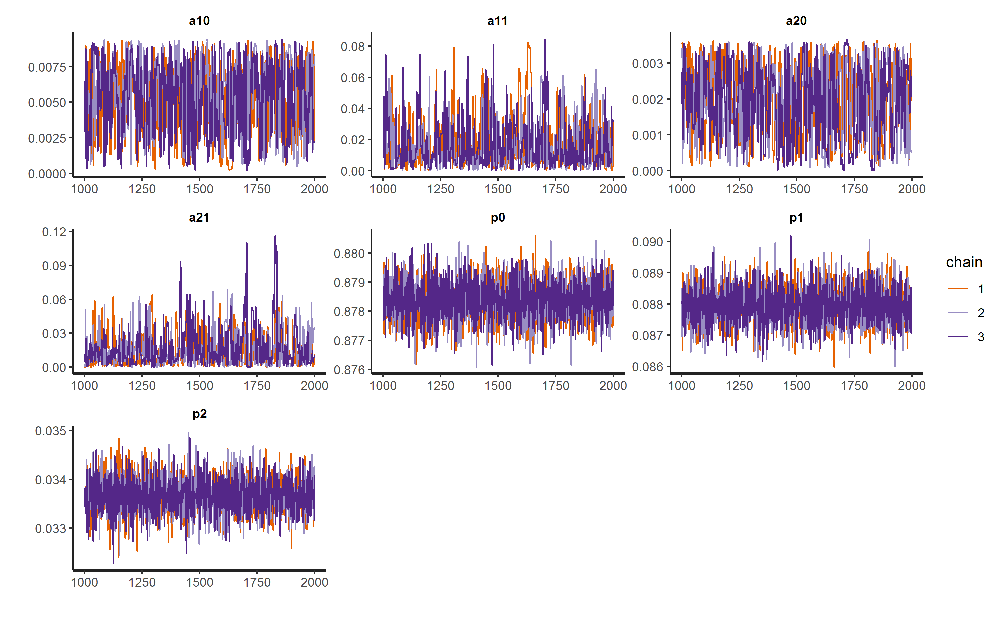

```{r setup, include=FALSE}
knitr::opts_chunk$set(echo = FALSE, cache=TRUE, out.width='100%',fig.pos = 'H')
```

# 模拟设置

\hl{\mbox{根据你写的内容，介绍模拟的背景，风险1和2，温度设置，检测时间以及样本量的设置等}}


# 贝叶斯推断

$$P(\theta|D) = \frac{P(\theta)P(D|\theta)}{\int P(\theta)P(D|\theta)}$$

\hl{\mbox{自己根据先前的文献写500字左右的贝叶斯推断的介绍，1面左右。}}

# 马尔科夫链蒙特卡洛模拟

\hl{\mbox{自己根据先前的文献写500字左右的马尔科夫链蒙特卡洛模拟的介绍，1面左右。}}


# 后验分布收敛性检验

由于本研究中贝叶斯推断采用马尔科夫链蒙特卡洛模拟抽样来逼近参数的后验分布，因此贝叶斯推断的有效性取决于模拟抽样是否达到了参数的稳定的后验分布。只有模拟抽样的后验分布达到稳定时，我们得到的参数估计才是有效的。在此研究中，我们采用三种办法来检验后验分布是否达到稳定状态：各个参数的有效抽样次数，Gelman-Rubin统计量和轨迹图。各种办法的检验标准如下：

- 有效抽样次数：当各个参数的有效抽样次数均大于100时，提示马尔科夫链蒙特卡洛模拟得到的参数后验分布达到了稳定状态，
- Gelman-Rubin统计量$\hat{R}$：当各个参数的Gelman-Rubin统计量均小于1.1时，提示马尔科夫链蒙特卡洛模拟得到的参数后验分布达到了稳定状态，
- 轨迹图：当各个参数的轨迹图没有明显的序列相关，在真实后验分布上下不规则震荡，并且整个图呈毛毛虫状时，提示马尔科夫链蒙特卡洛模拟得到的参数后验分布达到了稳定状态。

# 统计软件

本次模拟主要运用统计计算环境`R`（3.5.3版本）软件来实现[@Rruanjian]，其中贝叶斯建模与推断运用R软件包`rstan`（2.18.2版本）来实现[@rstan]。与其他的贝叶斯推断软件`WinBUGS`, `OpenBUGS`以及`JAGS`相比，Stan具有更灵活的因变量分布，更方便的自定义函数，更加活跃的用户群体论坛，以及依托于汉密尔顿马尔科夫链蒙特卡洛模拟的在大数据和多维空间情况下的更加高效和快速的抽样算法[@gelman2015stan]，因此适用于本模拟研究的统计推断。为了检验后验分布是否收敛，我们将抽样次数设置为2000，退火（热身）次数设置为1000，因此理论上最大的实际抽样次数为3000次，并且设置三条并行计算抽样的马尔科夫链，用以检验各个参数的后验分布是否收敛。


# 先验分布

对于本研究中的参数$\alpha_{10}, \alpha_{11}, \alpha_{20}, \alpha_{21}$，我们对其设置同样的弱信息量的伽马先验分布$\text{Gamma}(1, 10)$。选择此弱先验分布的原因是由我们的研究背景可以知道：

- 参数$\alpha_{10}, \alpha_{11}, \alpha_{20}, \alpha_{21}$均必须为正数，
- 参数$\alpha_{10}, \alpha_{11}, \alpha_{20}, \alpha_{21}$值均较小（一般小于1）。

在`rstan`中，伽马分布的参数化形式（即概率密度函数）如下所示：

\[
\text{Gamma}(y|\alpha, \beta) = \frac{\beta^\alpha}{\Gamma(\alpha)}y^{\alpha-1}\exp(-\beta y)
\]

伽马分布包括两个参数$\alpha$与$\beta$，其中$\alpha$为形状参数，$\beta$为率参数。该参数化形势下的伽马分布的均值为$\alpha/\beta$，方差为$\alpha/\beta^2$。该先验分布的概率密度图如下所示：

```{r }
pacman::p_load(tidyverse)

sim_gam = function(a, b){
  x = seq(0, 1, 0.001)
  y = b^a/factorial(a-1)*x^(a-1)*exp(-b*x)
  dat = data.frame(x, y)
  return(dat)
}

dat = sim_gam(1, 10)
ggplot(dat, aes(x, y)) + geom_line() + theme_bw()+ylab('GAMMA(1,10)')
```

由该图我们可以看出，四个不同的$\alpha$参数的先验分布的值域实际可处于$[0, +\infty]$之间，但是大部分概率密度均处于0-0.5之间，符合我们对此元器件故障参数的背景知识，并且此伽马分布也能够覆盖到所有参数$\alpha$的可能的取值，因此是合理的弱先验分布。

# 后验分布

```{r warning=FALSE,message=FALSE}
pacman::p_load(readr)
fit10csv = read_csv('data/fit10.csv')
fit50csv = read_csv('data/fit50.csv')
fit100csv = read_csv('data/fit100.csv')
fit500csv = read_csv('data/fit500.csv')
fit1000csv = read_csv('data/fit1000.csv')
```


```{r}
knitr::kable(fit10csv, digits = 4, caption = 'n=10')
```

```{r}
knitr::kable(fit50csv, digits = 4, caption = 'n=50')
```

```{r}
knitr::kable(fit100csv, digits = 4, caption = 'n=100')
```

```{r}
knitr::kable(fit500csv, digits = 4, caption = 'n=500')
```

```{r}
knitr::kable(fit1000csv, digits = 4, caption = 'n=1000')
```

\hl{\mbox{对以上每个表各个参数$\alpha$与$p$的后验分布与真实值之间的关系进行分析，差距是多少，可能是是由什么造成的}}

\hl{\mbox{（主要是样本量以及先验分布的选择）。}}

## 诊断

我们通过三种不同的方法来诊断此研究中贝叶斯估计的参数值收敛情况：有效抽样次数，Gelman-Rubin统计量$\hat{R}$，以及参数抽样的轨迹图。

### 有效抽样次数

由参数后验分布的倒数第二列中的有效抽样次数（n_eff）我们可以发现：大部分参数的后验分布抽样次数都大于100，提示模型的马尔科夫链蒙特卡洛模拟达到了稳定的参数后验分布。我们也发现对于部分模拟中，参数有效抽样次数仅为50个上下（例如样本量n=100时，参数a10的有效抽样次数仅为42.4）。这是因为后验分布的模拟抽取时，抽样之间存在很强的序列相关性，这种情况在参数之间高度相关时存在。我们可以通过其他的统计量来验证稳定的后验分布的假设。

### Gelman-Rubin统计量

由参数后验分布的最后一列中的Gelman-Rubin统计量（R_hat）我们可以发现，所有样本量下各个参数的Gelman-Rubin统计量（R_hat）均小于1.1，因此强烈提示马尔科夫链蒙特卡洛模拟得到的参数后验分布达到了稳定状态，`rstan`返回的结果可以用于分析。

### 轨迹图

从各个样本量下各个参数的轨迹图我们可以发现：尽管每个参数的三条马尔科夫链的初始值不同，但是他们最终都交汇到后验分布的均值处进行上下震荡，三条链充分混合，并且后验分布呈毛毛虫状，因此提示马尔科夫链蒙特卡洛模拟得到的参数后验分布达到了稳定状态。


```{r}
fit10 = readRDS('data/fit10.rds')
fit50 = readRDS('data/fit50.rds')
fit100 = readRDS('data/fit100.rds')
fit500 = readRDS('data/fit500.rds')
fit1000 = readRDS('data/fit1000.rds')
```


```{r fig.cap='n=10'}

```

```{r fig.cap='n=50'}

```


```{r fig.cap='n=100'}

```


```{r fig.cap='n=500'}

```


```{r fig.cap='n=1000'}

```


```{r eval=FALSE}
set.seed(123)

alpha = matrix(c(0.001, 0.05, 0.0001, 0.08), ncol = 2, byrow = TRUE)
w = c(45, 55)
t = matrix(seq(10, 40, 10), ncol = 2, byrow = TRUE)
K = c(10, 50, 100)


lambda = function(r = 1:2, j = 1:2) {
  alpha_r0 = alpha[r, 1]
  alpha_r1 = alpha[r, 2]
  return(alpha_r0*exp(alpha_r1*w[j]))
}

p = function(i = 1:2, j = 1:2){
  lam1j = lambda(1, j) # failure due to factor 1
  lam2j = lambda(2, j) # failure due to factor 2
  
  p0 = exp(-(lam1j + lam2j)*t[i, j])
  p1 = (lam1j/(lam1j + lam2j))*(1 - p0)
  p2 = (lam2j/(lam1j + lam2j))*(1 - p0)
  
  return(c(p0, p1, p2))
}

Tmatrxi = t(rmultinom(100, K[3], prob = p(1, 1)))
```


```{r eval=FALSE}
reliab = "
data {
  int<lower=0> n;
  int DAT[n, 3];
  vector[2] W;
  vector[4] Tim;
}
parameters{
  real<lower=0, upper=0.5> a10; 
  real<lower=0, upper=0.5> a11;
  real<lower=0, upper=0.5> a20; 
  real<lower=0, upper=0.5> a21;
}
transformed parameters{
  real<lower=0, upper=1> p0; 
  real<lower=0, upper=1> p1; 
  real<lower=0, upper=1> p2;
  vector<lower=0, upper=1>[3] p;
  
  p0 = exp(-(a10*exp(a11*W[1]) + a20*exp(a21*W[2]))*Tim[1]);
  p1 = (a10*exp(a11*W[1]))/(a10*exp(a11*W[1]) + a20*exp(a21*W[2]))*(1 - p0);
  p2 = 1-p0-p1;
  p = [p0, p1, p2]';
}
model{
  for (i in 1:n){
    //target += multinomial_lpmf(DAT[i,] | p);
    DAT[i,] ~ multinomial(p);
    //DAT[i,] ~ multi_log(p0, p1, p2);
  }
  a10 ~ gamma(1, 10);
  a11 ~ gamma(1, 10);
  a20 ~ gamma(1, 10);
  a21 ~ gamma(1, 10);
}
"

library(rstan)
rstan_options(auto_write = TRUE)

stan_dat = list(
  n = nrow(Tmatrxi),
  DAT = Tmatrxi,
  W = w,
  Tim = seq(10, 40, 10)
)

fit <- stan(
  model_code = reliab, data = stan_dat, #init_r = 0.1, init = 0.001, 
  warmup = 1000, iter = 2000, chains = 1, cores = 1, seed = 3)

summary(fit)
round(summary(fit)$summary[,1], 4)
```

```{r eval=FALSE}
# N = 10
set.seed(123)
Tmatrxi = t(rmultinom(10, 10, prob = p(1, 1)))

stan_dat = list(
  n = nrow(Tmatrxi),
  DAT = Tmatrxi,
  W = w,
  Tim = seq(10, 40, 10)
)

fit10 <- stan(
  model_code = reliab, data = stan_dat, #init_r = 0.1, init = 0.001, 
  warmup = 1000, iter = 2000, chains = 3, cores = 3, seed = 3, 
  control = list(adapt_delta = 0.95, max_treedepth = 15))

# N = 50
set.seed(123)
Tmatrxi = t(rmultinom(50, 50, prob = p(1, 1)))

stan_dat = list(
  n = nrow(Tmatrxi),
  DAT = Tmatrxi,
  W = w,
  Tim = seq(10, 40, 10)
)

fit50 <- stan(
  model_code = reliab, data = stan_dat, #init_r = 0.1, init = 0.001, 
  warmup = 1000, iter = 2000, chains = 3, cores = 3, seed = 3, 
  control = list(adapt_delta = 0.95, max_treedepth = 15))


# N = 100
set.seed(123)
Tmatrxi = t(rmultinom(100, 100, prob = p(1, 1)))

stan_dat = list(
  n = nrow(Tmatrxi),
  DAT = Tmatrxi,
  W = w,
  Tim = seq(10, 40, 10)
)

fit100 <- stan(
  model_code = reliab, data = stan_dat, #init_r = 0.1, init = 0.001, 
  warmup = 1000, iter = 2000, chains = 3, cores = 3, seed = 3, 
  control = list(adapt_delta = 0.95, max_treedepth = 15))


# N = 500
set.seed(123)
Tmatrxi = t(rmultinom(500, 500, prob = p(1, 1)))

stan_dat = list(
  n = nrow(Tmatrxi),
  DAT = Tmatrxi,
  W = w,
  Tim = seq(10, 40, 10)
)

fit500 <- stan(
  model_code = reliab, data = stan_dat, #init_r = 0.1, init = 0.001, 
  warmup = 1000, iter = 2000, chains = 3, cores = 3, seed = 3, 
  control = list(adapt_delta = 0.95, max_treedepth = 15))


# N = 1000
set.seed(123)
Tmatrxi = t(rmultinom(1000, 1000, prob = p(1, 1)))

stan_dat = list(
  n = nrow(Tmatrxi),
  DAT = Tmatrxi,
  W = w,
  Tim = seq(10, 40, 10)
)

fit1000 <- stan(
  model_code = reliab, data = stan_dat, #init_r = 0.1, init = 0.001, 
  warmup = 1000, iter = 2000, chains = 3, cores = 3, seed = 3, 
  control = list(adapt_delta = 0.95, max_treedepth = 15))

# write out tables
wtab = function(fit, filename){
  dat = as.data.frame(summary(fit)$summary[1:7,])
  write.csv(dat, paste0('data/', filename))
}

wtab(fit10, 'fit10.csv')
wtab(fit50, 'fit50.csv')
wtab(fit100, 'fit100.csv')
wtab(fit500, 'fit500.csv')
wtab(fit1000, 'fit1000.csv')

saveRDS(fit10, 'data/fit10.rds')
saveRDS(fit50, 'data/fit50.rds')
saveRDS(fit100, 'data/fit100.rds')
saveRDS(fit500, 'data/fit500.rds')
saveRDS(fit1000, 'data/fit1000.rds')

plot(fit10, plotfun = "trace", #inc_warmup = TRUE,
     pars = c("a10", "a11", "a20", "a21", "p0", "p1", "p2"))
ggsave('figs/fit10.png', dpi = 300, height = 6.18, width = 10)
plot(fit50, plotfun = "trace", #inc_warmup = TRUE,
     pars = c("a10", "a11", "a20", "a21", "p0", "p1", "p2"))
ggsave('figs/fit50.png', dpi = 300, height = 6.18, width = 10)
plot(fit100, plotfun = "trace", #inc_warmup = TRUE,
     pars = c("a10", "a11", "a20", "a21", "p0", "p1", "p2"))
ggsave('figs/fit100.png', dpi = 300, height = 6.18, width = 10)
plot(fit500, plotfun = "trace", #inc_warmup = TRUE,
     pars = c("a10", "a11", "a20", "a21", "p0", "p1", "p2"))
ggsave('figs/fit500.png', dpi = 300, height = 6.18, width = 10)
plot(fit1000, plotfun = "trace", #inc_warmup = TRUE,
     pars = c("a10", "a11", "a20", "a21", "p0", "p1", "p2"))
ggsave('figs/fit1000.png', dpi = 300, height = 6.18, width = 10)
```


# 参考文献{-}